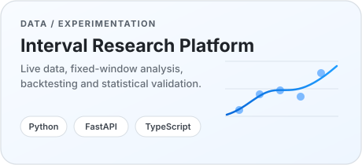
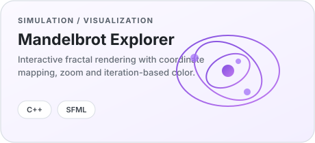
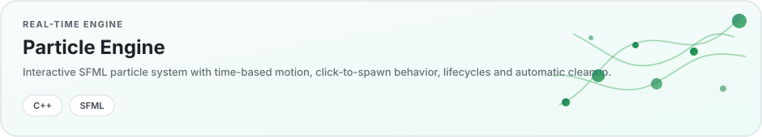

  

 

  I like building systems where ideas can be <b>tested, measured, and improved</b> — from interactive C++ simulations to data-driven research tools.

 

<h2 align="center">Selected work</h2>

  
  

  

 

<h2 align="center">What I’m drawn to</h2>

  <b>Software engineering</b> &nbsp;·&nbsp; <b>Machine learning</b> &nbsp;·&nbsp; <b>Systems</b> &nbsp;·&nbsp; <b>Simulation</b> &nbsp;·&nbsp; <b>Quantitative research</b>

 

  Clear code. Reproducible experiments. Useful software.

